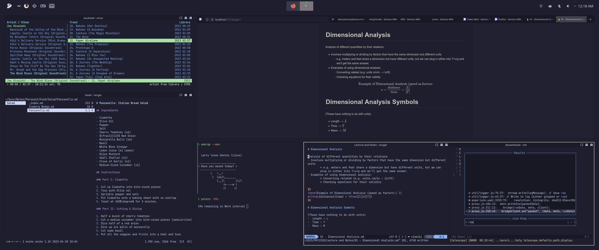

# Encho's Dotfiles

My dotfiles. Have fun, caveat emptor, blah blah blah.

# Bootstrapping Process

> Location: `.config/yadm/bootstrap`

The bootstrap script is an interactive bash file that walks the user through installing things that couldn't be installed by a simple clone (e.g. Firefox tweaks). These are the steps it walks through:
1. Install Arkenfox + user-overrides.js
2. Install Cascade + userChrome.css
3. Update/Install all Zsh Plugins (powerlevel10k + zsh-autosuggestions + zsh-history-substring-search + zsh-syntax-highlighting)
4. Merge ~/.Xresources (doesn't change the Xresources file)

It's all very streamlined and nice.

# Images




# The Big Picture

Tools don't exist in a vacuum and I don't have dotfiles for every tool I use; so here's a brief overview of the roles my favorite tools fulfill in my day-to-day life:

- **Lecture and Notes**: [Neovim](https://github.com/neovim/neovim) + [Syncthing](https://github.com/syncthing/syncthing) + [Markor](https://github.com/gsantner/markor)
- **Flashcards**: [Anki](https://github.com/ankitects/anki) + [Ankidroid](https://github.com/ankidroid/Anki-Android)
- **Lecture Videos**: [Auto Editor](https://auto-editor.com/)
- **Writing**: [LibreOffice Writer (Suite)](https://github.com/libreoffice)
- **Spell & Grammer Check**: [LanguageTool](https://github.com/languagetool-org/languagetool)
- **Metasearch**: [SearXng](https://github.com/searxng/searxng)
- **Music**: [Cmus](https://github.com/cmus/cmus) + [Nicotine+](https://github.com/nicotine-plus/nicotine-plus)
- **To-do List**: [Todo.txt](https://github.com/todotxt/todo.txt) + [Simpletask](https://github.com/mpcjanssen/simpletask-android)
- **Email**: [Claws Mail](https://git.claws-mail.org/)
- **Pomodoro**: [Potato Redux](https://github.com/Enchoseon/potato-redux)
- **Ad-Blocking**: [uBlock Origin](https://github.com/gorhill/uBlock) + [hBlock](https://github.com/hectorm/hblock)
- **Multi-Button Mouse**: [Piper](https://github.com/libratbag/piper) + KDE Keyboard Daemon (it's just a GUI for [x11-misc/
xkeyboard-config](https://packages.gentoo.org/packages/x11-misc/xkeyboard-config))

To see *how* these tools fulfill their roles, see my (even more) highly opinionated [blog post](https://enchoseon.com/productivity-tools), which is like my meta-dotfiles I guess.

# Licenses & Redistribution

This repository stores and redistributes some binaries/scripts (e.g. every zsh plugin I use) so that bootstrapping is just a simple and reproducible clone. Many of these binaries/scripts haven't been updated in 2 years (and hopefully shouldn't need to be!) However, a convenient way to update all of them is currently lacking.

## Zsh

### [Catppuccin for zsh-syntax-highlighting](https://github.com/catppuccin/zsh-syntax-highlighting)

- Location: `.config/.zsh/catppuccin_mocha-zsh-syntax-highlighting.zsh`
- LICENSE: [MIT License](https://github.com/catppuccin/zsh-syntax-highlighting/blob/main/LICENSE)

```
MIT License

Copyright (c) 2021 Catppuccin

Permission is hereby granted, free of charge, to any person obtaining a copy
of this software and associated documentation files (the "Software"), to deal
in the Software without restriction, including without limitation the rights
to use, copy, modify, merge, publish, distribute, sublicense, and/or sell
copies of the Software, and to permit persons to whom the Software is
furnished to do so, subject to the following conditions:

The above copyright notice and this permission notice shall be included in all
copies or substantial portions of the Software.

THE SOFTWARE IS PROVIDED "AS IS", WITHOUT WARRANTY OF ANY KIND, EXPRESS OR
IMPLIED, INCLUDING BUT NOT LIMITED TO THE WARRANTIES OF MERCHANTABILITY,
FITNESS FOR A PARTICULAR PURPOSE AND NONINFRINGEMENT. IN NO EVENT SHALL THE
AUTHORS OR COPYRIGHT HOLDERS BE LIABLE FOR ANY CLAIM, DAMAGES OR OTHER
LIABILITY, WHETHER IN AN ACTION OF CONTRACT, TORT OR OTHERWISE, ARISING FROM,
OUT OF OR IN CONNECTION WITH THE SOFTWARE OR THE USE OR OTHER DEALINGS IN THE
SOFTWARE.
```

### [Zsh Autosuggestions](https://github.com/zsh-users/zsh-autosuggestions)

- Location: `.config/.zsh/zsh-autosuggestions/*`
- LICENSE: [MIT License](https://github.com/zsh-users/zsh-autosuggestions/blob/master/LICENSE)

```
Copyright (c) 2013 Thiago de Arruda
Copyright (c) 2016-2021 Eric Freese

Permission is hereby granted, free of charge, to any person
obtaining a copy of this software and associated documentation
files (the "Software"), to deal in the Software without
restriction, including without limitation the rights to use,
copy, modify, merge, publish, distribute, sublicense, and/or sell
copies of the Software, and to permit persons to whom the
Software is furnished to do so, subject to the following
conditions:

The above copyright notice and this permission notice shall be
included in all copies or substantial portions of the Software.

THE SOFTWARE IS PROVIDED "AS IS", WITHOUT WARRANTY OF ANY KIND,
EXPRESS OR IMPLIED, INCLUDING BUT NOT LIMITED TO THE WARRANTIES
OF MERCHANTABILITY, FITNESS FOR A PARTICULAR PURPOSE AND
NONINFRINGEMENT. IN NO EVENT SHALL THE AUTHORS OR COPYRIGHT
HOLDERS BE LIABLE FOR ANY CLAIM, DAMAGES OR OTHER LIABILITY,
WHETHER IN AN ACTION OF CONTRACT, TORT OR OTHERWISE, ARISING
FROM, OUT OF OR IN CONNECTION WITH THE SOFTWARE OR THE USE OR
OTHER DEALINGS IN THE SOFTWARE.
```

### [Zsh History Substring Search](https://github.com/zsh-users/zsh-history-substring-search)

- Location: `.config/.zsh/zsh-history-substring-search/*`
- LICENSE: [BSD-3-Clause License](https://github.com/zsh-users/zsh-history-substring-search/blob/master/zsh-history-substring-search.zsh)

```
Copyright (c) 2009 Peter Stephenson
Copyright (c) 2011 Guido van Steen
Copyright (c) 2011 Suraj N. Kurapati
Copyright (c) 2011 Sorin Ionescu
Copyright (c) 2011 Vincent Guerci
Copyright (c) 2016 Geza Lore
Copyright (c) 2017 Bengt Brodersen
All rights reserved.

Redistribution and use in source and binary forms, with or without
modification, are permitted provided that the following conditions are met:

 * Redistributions of source code must retain the above copyright
   notice, this list of conditions and the following disclaimer.

 * Redistributions in binary form must reproduce the above
   copyright notice, this list of conditions and the following
   disclaimer in the documentation and/or other materials provided
   with the distribution.

 * Neither the name of the FIZSH nor the names of its contributors
   may be used to endorse or promote products derived from this
   software without specific prior written permission.

THIS SOFTWARE IS PROVIDED BY THE COPYRIGHT HOLDERS AND CONTRIBUTORS "AS IS"
AND ANY EXPRESS OR IMPLIED WARRANTIES, INCLUDING, BUT NOT LIMITED TO, THE
IMPLIED WARRANTIES OF MERCHANTABILITY AND FITNESS FOR A PARTICULAR PURPOSE
ARE DISCLAIMED. IN NO EVENT SHALL THE COPYRIGHT HOLDER OR CONTRIBUTORS BE
LIABLE FOR ANY DIRECT, INDIRECT, INCIDENTAL, SPECIAL, EXEMPLARY, OR
CONSEQUENTIAL DAMAGES (INCLUDING, BUT NOT LIMITED TO, PROCUREMENT OF
SUBSTITUTE GOODS OR SERVICES; LOSS OF USE, DATA, OR PROFITS; OR BUSINESS
INTERRUPTION) HOWEVER CAUSED AND ON ANY THEORY OF LIABILITY, WHETHER IN
CONTRACT, STRICT LIABILITY, OR TORT (INCLUDING NEGLIGENCE OR OTHERWISE)
ARISING IN ANY WAY OUT OF THE USE OF THIS SOFTWARE, EVEN IF ADVISED OF THE
POSSIBILITY OF SUCH DAMAGE.
```

### [Zsh Syntax Highlighting](https://github.com/zsh-users/zsh-syntax-highlighting)

- Location: `.config/.zsh/zsh-syntax-highlighting/*`
- LICENSE: [BSD-3-Clause License](https://github.com/zsh-users/zsh-syntax-highlighting/blob/master/COPYING.md)

```
Copyright (c) 2010-2020 zsh-syntax-highlighting contributors All rights reserved.

Redistribution and use in source and binary forms, with or without modification, are permitted provided that the following conditions are met:

    Redistributions of source code must retain the above copyright notice, this list of conditions and the following disclaimer.
    Redistributions in binary form must reproduce the above copyright notice, this list of conditions and the following disclaimer in the documentation and/or other materials provided with the distribution.
    Neither the name of the zsh-syntax-highlighting contributors nor the names of its contributors may be used to endorse or promote products derived from this software without specific prior written permission.

THIS SOFTWARE IS PROVIDED BY THE COPYRIGHT HOLDERS AND CONTRIBUTORS "AS IS" AND ANY EXPRESS OR IMPLIED WARRANTIES, INCLUDING, BUT NOT LIMITED TO, THE IMPLIED WARRANTIES OF MERCHANTABILITY AND FITNESS FOR A PARTICULAR PURPOSE ARE DISCLAIMED. IN NO EVENT SHALL THE COPYRIGHT HOLDER OR CONTRIBUTORS BE LIABLE FOR ANY DIRECT, INDIRECT, INCIDENTAL, SPECIAL, EXEMPLARY, OR CONSEQUENTIAL DAMAGES (INCLUDING, BUT NOT LIMITED TO, PROCUREMENT OF SUBSTITUTE GOODS OR SERVICES; LOSS OF USE, DATA, OR PROFITS; OR BUSINESS INTERRUPTION) HOWEVER CAUSED AND ON ANY THEORY OF LIABILITY, WHETHER IN CONTRACT, STRICT LIABILITY, OR TORT (INCLUDING NEGLIGENCE OR OTHERWISE) ARISING IN ANY WAY OUT OF THE USE OF THIS SOFTWARE, EVEN IF ADVISED OF THE POSSIBILITY OF SUCH DAMAGE.
```

### [Powerlevel10k](https://github.com/romkatv/powerlevel10k)

- Location: `.config/.zsh/powerlevel10k/*`
- LICENSE: [MIT License](https://github.com/romkatv/powerlevel10k/blob/master/LICENSE)

```
Copyright (c) 2009-2014 Robby Russell and contributors (see https://github.com/robbyrussell/oh-my-zsh/contributors)
Copyright (c) 2014-2017 Ben Hilburn <bhilburn@gmail.com>
Copyright (c) 2019 Roman Perepelitsa <roman.perepelitsa@gmail.com> and contributors (see https://github.com/romkatv/powerlevel10k/contributors)

MIT LICENSE

Permission is hereby granted, free of charge, to any person obtaining a copy of
this software and associated documentation files (the "Software"), to deal in
the Software without restriction, including without limitation the rights to
use, copy, modify, merge, publish, distribute, sublicense, and/or sell copies of
the Software, and to permit persons to whom the Software is furnished to do so,
subject to the following conditions:

The above copyright notice and this permission notice shall be included in all
copies or substantial portions of the Software.

THE SOFTWARE IS PROVIDED "AS IS", WITHOUT WARRANTY OF ANY KIND, EXPRESS OR
IMPLIED, INCLUDING BUT NOT LIMITED TO THE WARRANTIES OF MERCHANTABILITY, FITNESS
FOR A PARTICULAR PURPOSE AND NONINFRINGEMENT. IN NO EVENT SHALL THE AUTHORS OR
COPYRIGHT HOLDERS BE LIABLE FOR ANY CLAIM, DAMAGES OR OTHER LIABILITY, WHETHER
IN AN ACTION OF CONTRACT, TORT OR OTHERWISE, ARISING FROM, OUT OF OR IN
CONNECTION WITH THE SOFTWARE OR THE USE OR OTHER DEALINGS IN THE SOFTWARE.
```

## Firefox

### [Arkenfox User.js](https://github.com/arkenfox/user.js)

- Location: `.config/yadm/firefox/user.js/*`
- LICENSE: [MIT License](https://github.com/arkenfox/user.js/blob/master/LICENSE.txt)

```
MIT License

Copyright (c) 2020 arkenfox

Permission is hereby granted, free of charge, to any person obtaining a copy
of this software and associated documentation files (the "Software"), to deal
in the Software without restriction, including without limitation the rights
to use, copy, modify, merge, publish, distribute, sublicense, and/or sell
copies of the Software, and to permit persons to whom the Software is
furnished to do so, subject to the following conditions:

The above copyright notice and this permission notice shall be included in all
copies or substantial portions of the Software.

THE SOFTWARE IS PROVIDED "AS IS", WITHOUT WARRANTY OF ANY KIND, EXPRESS OR
IMPLIED, INCLUDING BUT NOT LIMITED TO THE WARRANTIES OF MERCHANTABILITY,
FITNESS FOR A PARTICULAR PURPOSE AND NONINFRINGEMENT. IN NO EVENT SHALL THE
AUTHORS OR COPYRIGHT HOLDERS BE LIABLE FOR ANY CLAIM, DAMAGES OR OTHER
LIABILITY, WHETHER IN AN ACTION OF CONTRACT, TORT OR OTHERWISE, ARISING FROM,
OUT OF OR IN CONNECTION WITH THE SOFTWARE OR THE USE OR OTHER DEALINGS IN THE
SOFTWARE.
```

### [Cascade](https://github.com/andreasgrafen/cascade)

- Location: `.config/yadm/firefox/chrome/*`
- LICENSE: [MIT License](https://github.com/andreasgrafen/cascade/blob/main/LICENSE)

```
MIT License

Copyright (c) 2022 Andreas Grafen

Permission is hereby granted, free of charge, to any person obtaining a copy
of this software and associated documentation files (the "Software"), to deal
in the Software without restriction, including without limitation the rights
to use, copy, modify, merge, publish, distribute, sublicense, and/or sell
copies of the Software, and to permit persons to whom the Software is
furnished to do so, subject to the following conditions:

The above copyright notice and this permission notice shall be included in all
copies or substantial portions of the Software.

THE SOFTWARE IS PROVIDED "AS IS", WITHOUT WARRANTY OF ANY KIND, EXPRESS OR
IMPLIED, INCLUDING BUT NOT LIMITED TO THE WARRANTIES OF MERCHANTABILITY,
FITNESS FOR A PARTICULAR PURPOSE AND NONINFRINGEMENT. IN NO EVENT SHALL THE
AUTHORS OR COPYRIGHT HOLDERS BE LIABLE FOR ANY CLAIM, DAMAGES OR OTHER
LIABILITY, WHETHER IN AN ACTION OF CONTRACT, TORT OR OTHERWISE, ARISING FROM,
OUT OF OR IN CONNECTION WITH THE SOFTWARE OR THE USE OR OTHER DEALINGS IN THE
SOFTWARE.
```
